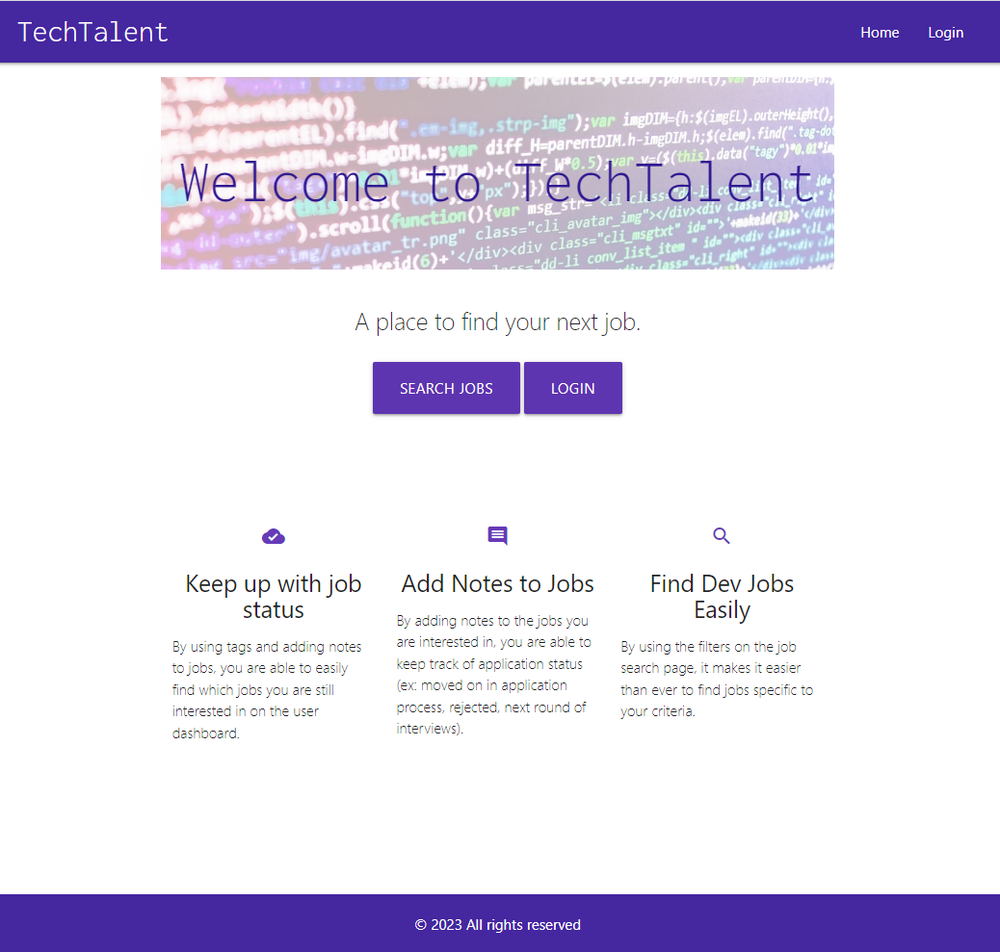
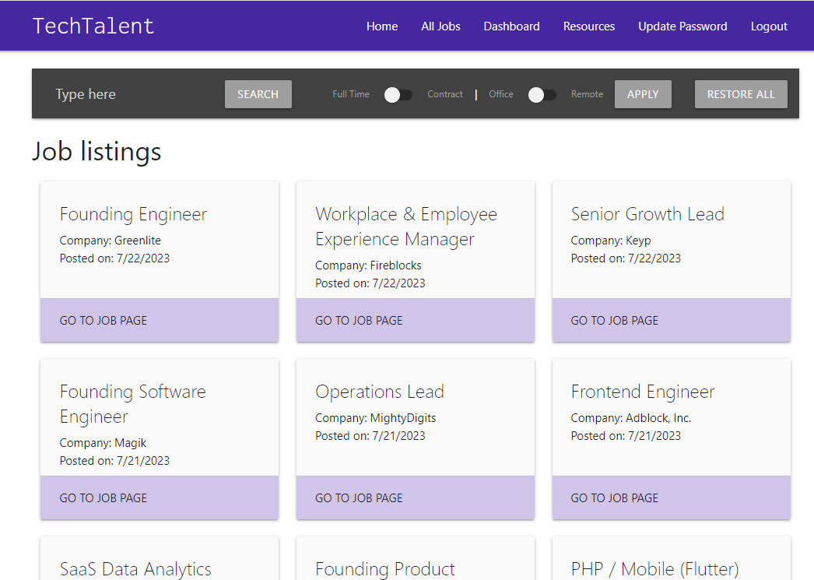
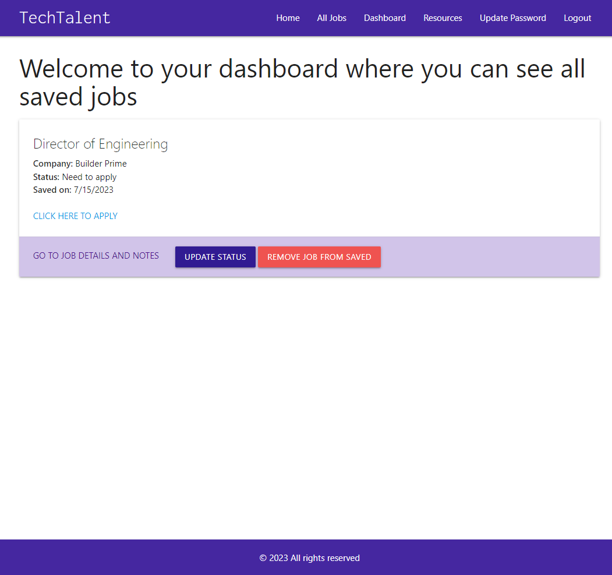

# Tech Talent


## Description 

Full stack web application that allows users to browse Dev job listings, save jobs to the database, update status, and add notes. This app follows the MVC paradigm in its architectural structure, using Handlebars.js as the templating language, Sequelize as the ORM, and the express-session npm package for authentication.

Link to deployed application: https://stark-atoll-54183-6f5d9962b281.herokuapp.com/

## Table of Contents

- [Installation](#installation)
- [Usage](#usage)
- [Questions](#questions)
- [License](#license)

## Installation

To install necessary dependencies, run the following command:

```npm i```

## Usage

When visiting app for the first time, on the homepage, user able to search for all the jobs. However, to get full access to functionality to be able to search, save and add notes to the jobs, user needs to create an account. 

Example homepage when user is not signed in: 

 

Example of Job Search page when user is signed in: 

 

Example of Dashboard page when user is signed in: 

 

## Questions
GitHub profile: [vlada-caban](https://github.com/vlada-caban)

## License 
License: MIT